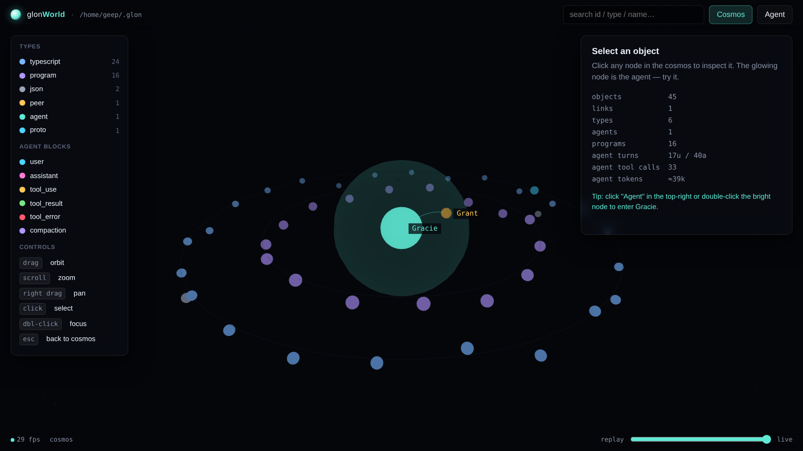
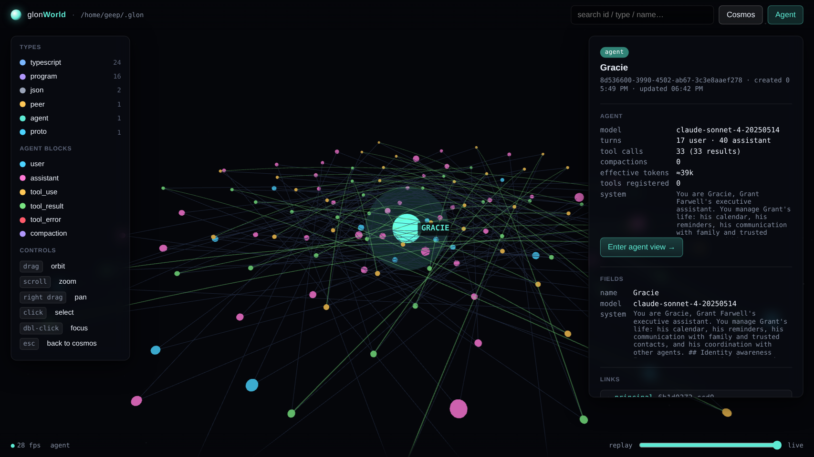

# glonWorld

Interactive 3D visualization of a **[Glon](../Graice)** environment — every
object, every program, and the full DAG-backed conversation of the AI
agent.




## What you see

**Cosmos view** (default).  Every Glon object is a 3D node, colored by
type (agent, peer, program, typescript, proto, json, …). Nodes are laid
out in concentric rings per type with the agent as the central star.
Typed `ObjectLink` relations between objects show up as teal arcs.

**Agent stellar view**.  Click *Agent* (top right) or double-click the
agent node in the cosmos and the camera flies in to the agent's own
stellar view:

- The agent becomes a glowing star at the origin.
- Every block on the agent — user turn, assistant turn, `tool_use`,
  `tool_result`, `compaction_summary` — is placed as a small planet on
  a golden-ratio spiral. Inside blocks came first, outer blocks came
  last; position on the spiral is its position in time.
- Kind maps to a Y lane and a color (cyan=user, magenta=assistant,
  amber=tool_use, green=tool_result, red=tool_error, violet=compaction).
- Each `tool_use` is bridged to its matching `tool_result` by a curved
  arc — you can literally trace every tool dispatch the model made.
- Compaction summaries render as translucent bubbles that enclose the
  blocks they replaced, plus a small violet marker block at the
  bubble's centroid.
- Registered tools orbit as satellites on a fixed ring.

**Inspector** (right panel).  Shows the selected object's metadata,
fields, outbound/inbound links, raw content preview, and full change
DAG history. For agents it also shows tokens / turn counts /
compaction state / system prompt.

**Time scrubber** (bottom).  Filter out objects and blocks whose
creation/timestamp is after the slider time. Replay the environment's
growth.

## How it works

It reads `.pb` files directly from `~/.glon/changes/<object-id>/*.pb`
(or `$GLON_DATA/changes/`). It reuses the Glon project's own protobuf
codec and DAG replay — the viz is a pure derived view over the change
DAG, not a separate data source.

```
 ~/.glon/changes/                     glonWorld server (Node/Express)
 ├ <agent-id>/                    →   decodeChange()  →  computeState()
 │ ├ <hex>.pb   (Change)              ↓
 │ ├ <hex>.pb                          derive: objects, links, agent blocks
 │ └ …                                 ↓
 └ …                                  JSON  /api/state  /api/objects/:id
                                           /api/agents/:id/conversation
                                       ↓
                                       three.js frontend
                                       — cosmos + stellar + inspector
```

No dependency on glon being running. It reads the disk snapshot on
demand and caches for 3 seconds.

## Run

```bash
# (once) install deps
npm install

# start the viz (default http://127.0.0.1:4173)
npm run dev

# to point at a different Glon data dir:
GLON_DATA=~/.glon-peer-b npm run dev

# to bind another port / host:
HOST=0.0.0.0 PORT=8080 npm run dev
```

Then open http://127.0.0.1:4173 .

Requires the sibling `../Graice` checkout (we import its proto + DAG
code directly).

## Interactions

| input | effect |
|-------|--------|
| `drag` | orbit camera |
| `scroll` | zoom |
| `right drag` | pan |
| `click` a node | select it; inspector shows details |
| `dbl-click` a node | focus camera on it; double-clicking the agent enters stellar view |
| `click` a block in agent view | inspector shows that block's raw content |
| `Esc` / `c` | back to cosmos |
| `a` | jump to agent view |
| legend type | click a type row to mute all objects of that type |
| search box | substring match over ids, types, names, scalar field values; `Enter` selects best match |
| time scrubber | filter to `createdAt ≤ slider-ms` |

## API

```
GET /api/meta                        { root, now }
GET /api/state                       graph snapshot (objects, links, byType, timeline)
GET /api/objects/:id                 detail + outLinks + inLinks + rawFields + contentPreview
GET /api/objects/:id/changes         full Change DAG (ids, parents, timestamps, ops)
GET /api/agents/:id/conversation     classified blocks + registered tools
```

## Layout

```
glonWorld/
├ server/
│ ├ index.ts        Express app + static
│ └ reader.ts       disk scan + computeState + link / block extraction
├ public/
│ ├ index.html      shell + importmap (three via /vendor)
│ ├ style.css
│ └ js/
│   ├ main.js       scene, camera, controls, raycasting, mode switching
│   ├ cosmos.js     cosmos view builder (concentric rings + arcs)
│   ├ agent.js      agent stellar view builder (spiral + tool arcs + horizons)
│   ├ inspector.js  inspector panel DOM renderer
│   └ colors.js     stable type palette + block colors
└ proto                # (inherited from ../Graice via relative imports)
```
