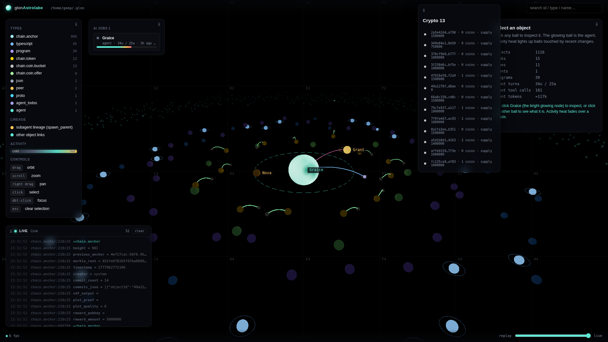
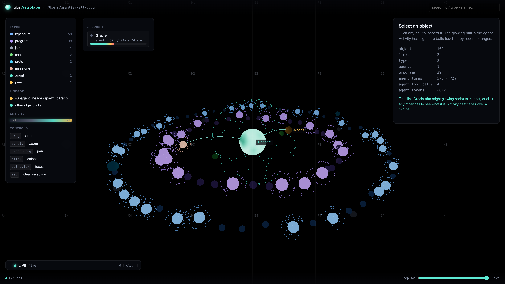
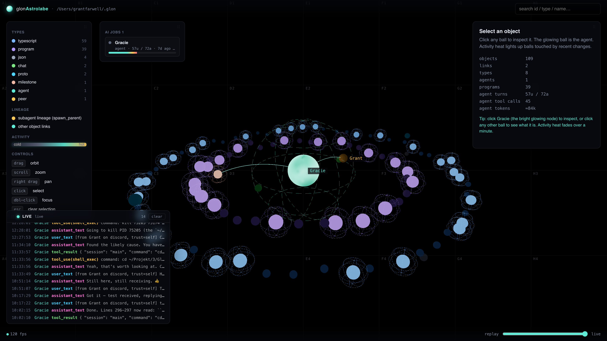

# glonSystem

Live 3D dashboard for a **[glon](https://github.com/Geep5/glon)** environment. One scene, one view: every object on disk is a ball; every change-file write becomes a glow, a halo, or a row in the live console.



<details>
<summary>more screenshots</summary>





</details>

## What you see

**The cosmos.** Every object glon knows about is a node, colored by type (agent, peer, program, typescript, proto, json, pinned_fact, milestone, reminder, …). Nodes orbit on per-type rings with the agent at the origin. They float on a per-axis sin-wave drift so the scene feels alive without any global rotation. Links between objects render as quadratic-Bezier arcs (teal for normal `ObjectLink` relations, amber for `spawn_parent` lineage), rebuilt each frame so they track the floating endpoints exactly.

**Activity heat.** Every object remembers a `lastSeen` timestamp, seeded from `obj.updatedAt` and bumped from the live SSE stream. Heat decays as `exp(-Δt / 30s)` and drives three things: emissive intensity, halo opacity, and a subtle scale pulse. A search/list/get tool call lights up *every* object id mentioned in its input or result, not just the agent that issued it.

**In-context halo.** The cosmos asks the server for the set of object ids referenced by any block currently in the active agent's context window (post-latest-compaction). Those balls get a persistent halo + 18% scale boost — visually distinct from the transient heat. Heat stacks on top.

**Cursor magnet.** Move the pointer near the cosmos and balls within ~4.5 world units of the cursor's pick-ray slide toward it (linearly to zero at the edge of the magnet zone, smoothed at 20% per frame). Makes small targets easy to click.

**Live event log** (bottom-left). SSE-tail of `~/.glon/changes/`. Every new `.pb` file becomes one row per op: `tool_use(name)`, `tool_result`, `assistant_text`, `compaction(N tok)`, `+block`, `field key=value`, `+create`. Color-coded per op kind. Click a row to open that object in the inspector. Auto-opens on the first event; the green dot pulses while the SSE channel is connected.

**AI jobs panel** (in the legend, between Activity and Controls). One row per agent with a context-window fill bar (`effectiveTokens / contextWindow`, gradient from teal → yellow → red as you approach the compaction threshold). Plus one row per reminder in the last 24h, colored by status:
- **pending** — pulsing yellow dot, countdown bar that fills toward `fire_at_ms`, meta `reminder · fires in 1m 30s`. Updates every second.
- **sent** — dim white bar, gray dot.
- **failed** — red bar + glowing red dot. (Loud on purpose; this is how you catch a broken scheduler.)
- **cancelled** — stroke-color bar, dim dot.

**Inspector** (right panel). Object metadata, fields, outbound/inbound links, raw content preview, full change DAG, and — for agents — model / turn counts / compaction state / system prompt. Two action affordances:
- **`→ Inject into context`** appears on any object that isn't the active agent and isn't already in its context. Posts a structured `user_text` reference (type, name, id, scalar fields, content snippet) via `/agent ask` so the agent's next turn sees it.
- **`← Recall into context`** appears on compacted blocks (when you click a search hit). Re-injects the original block as a fresh `user_text` via the glon daemon's `/agent recall` action.

**Search** (top input). Live highlight on type/name/id/scalar value, plus a debounced server-side query that scans every agent block — `text`, `tool_use` input, compaction summary. Results panel shows snippets centered on the match, with a `live`/`compacted` chip per hit. Click a result to select the host agent and open that block in the inspector (recall button auto-renders if it's compacted).

**Time scrubber** (bottom). Filter out objects whose `createdAt` is after the slider time. Replay the environment's growth.

## How it works

```
~/.glon/changes/                  glonSystem server (Node / Express)
├ <object-id>/                →   decodeChange()  →  computeState()
│ ├ <hex>.pb   (Change)            ↓
│ ├ <hex>.pb                       derive: VizObject + agentStats + outLinks + memoryRefs
│ └ …                              ↓
└ …                                /api/state, /api/objects/:id,
                                   /api/agents/:id/conversation,
                                   /api/agents/:id/context,
                                   /api/search,
                                   /api/events  (SSE: fs.watch → decoded change events)
                                   ↓
                                   three.js frontend
                                   — cosmos + heat + magnet + inspector + jobs + log
```

Read path has **no dependency on glon being running** — it reads the disk snapshot on demand and caches for 3 s. The SSE watcher (`fs.watch` recursive on the changes dir) tails new `.pb` files and decodes each one as it lands.

The **mutation paths** (`POST /api/agents/:id/recall/:blockId` and `POST /api/agents/:agentId/inject/:objectId`) require the glon daemon to be running. They proxy to its HTTP dispatch endpoint (`:6430` by default — see `GLON_DISPATCH_URL`). When the daemon isn't reachable, the calls return 503 and the read-only viz still works.

### Server-side data hygiene

- **Junk filter** — drops objects with no `typeKey` and agents whose `system` field is suspiciously short. Set `GLON_SYSTEM_JUNK_FILTER=0` to disable.
- **Dedupe filter** — collapses identity-duplicate peers and agents (same `display_name + kind + email + discord_id` for peers; same `name` for agents). Keeps the member with the highest `changeCount`. Set `GLON_SYSTEM_DEDUPE=0` to disable.

Both filters log every drop to the server console on each cache rebuild.

## Run

```bash
npm install
npm run dev      # http://127.0.0.1:4173
```

Requires the sibling `../Graice` checkout — the reader imports proto + DAG code via `../../Graice/src/...`.

### Environment variables

| Variable | Default | Purpose |
|---|---|---|
| `HOST` | `127.0.0.1` | bind host |
| `PORT` | `4173` | bind port |
| `GLON_DATA` | `~/.glon` | DAG root directory to read from |
| `GLON_DISPATCH_URL` | `http://127.0.0.1:6430/dispatch` | glon daemon HTTP dispatch (used by recall + inject) |
| `GLON_SYSTEM_DEDUPE` | unset (on) | set to `0` to show identity-duplicate objects raw |
| `GLON_SYSTEM_JUNK_FILTER` | unset (on) | set to `0` to keep malformed objects |

```bash
GLON_DATA=~/.glon-peer-b npm run dev               # different DAG root
HOST=0.0.0.0 PORT=8080 npm run dev                  # bind elsewhere
GLON_SYSTEM_DEDUPE=0 GLON_SYSTEM_JUNK_FILTER=0 npm run dev   # raw mode
```

## Interactions

| input | effect |
|-------|--------|
| `drag` | orbit |
| `scroll` | zoom |
| `right drag` | pan |
| `click` a ball | select; inspector shows details |
| `dbl-click` a ball | focus camera on it |
| `click` an event row | select the object that emitted it |
| `click` an AI Jobs row | select that agent or reminder |
| `Esc` | clear selection |
| legend type | click a type row to mute all objects of that type |
| search box | live object highlight + debounced backend search over block text |
| `click` a search result | fly to the host agent + open the block in the inspector |
| `Enter` in search | select best object match (or block hit if no object matches) |
| `Esc` in search | dismiss the results panel |
| time scrubber | filter to `createdAt ≤ slider-ms` |

## API

```
GET  /api/meta                                 { root, now }
GET  /api/state                                graph snapshot (objects, links, byType, timeline)
GET  /api/objects/:id                          detail + outLinks + inLinks + rawFields + contentPreview
GET  /api/objects/:id/changes                  full Change DAG (ids, parents, timestamps, ops)
GET  /api/agents/:id/conversation              classified blocks + registered tools
GET  /api/agents/:id/context                   { agentId, agentName, objectIds }: ids referenced by
                                                 any in-context block of the agent (drives the cosmos
                                                 in-context halo)
GET  /api/search?q=…&limit=20                  free-text hits over object metadata + agent block content
GET  /api/events                               SSE stream of new glon changes (replays last ~50 on
                                                 connect, then live; 15s heartbeat)
GET  /api/events/recent                        ring buffer of the last ≤200 events as JSON
POST /api/agents/:id/recall/:blockId           re-inject a compacted block via the glon daemon
POST /api/agents/:agentId/inject/:objectId     post a user_text describing this object so the agent's
                                                 next turn sees it
```

## Layout

```
glonSystem/
├ server/
│ ├ index.ts     Express + static + SSE + recall + inject + search routes
│ ├ reader.ts    disk scan + computeState + dedupe/junk filters + agent context refs
│ └ events.ts    fs.watch on the changes dir + per-change op summarizer + SSE bus
├ public/
│ ├ index.html   shell + importmap (three via /vendor) + jobs panel
│ ├ style.css
│ └ js/
│   ├ main.js     scene, camera, controls, raycasting, jobs panel, search, recall/inject wiring
│   ├ cosmos.js   ball layout, float drift, cursor magnet, heat, in-context halo, link tubes
│   ├ inspector.js inspector panel DOM renderer + recall + inject buttons
│   ├ livelog.js  SSE EventSource client + console-style row renderer
│   └ colors.js   stable type palette + block colors
└ snapshots/     screenshots referenced from this README
```

The reader pulls proto + DAG code from `../Graice/src/...`. There is no compile step on the frontend — `index.html` uses an importmap to resolve `three` from `node_modules`.
